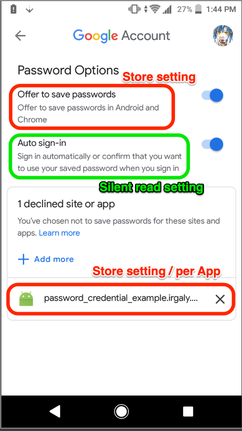

# password_credential

Flutter Plugin for Password Credentials Access.

* Web (Chrome): Credentials Management API
    * [Chrome Credentials Management Document](https://developers.google.com/web/fundamentals/security/credential-management/retrieve-credentials?hl=en)
* Android: Smartlock for Password
    * [Android Smartlock for Password Document](https://developer.android.com/distribute/best-practices/develop/smart-lock-for-passwords)
* iOS: iCloud Key-Value Storage

ID and Passwords stored in Credential Management API or Smartlock are synced when user logged in Chrome Android with same Google Account.

## Example Project

Web Example Project.

Android Example Project.

## User Settings

This section describes User-side Settings for Credentials Management System.

If the user has disabled Password Storing at System wide, or disabled per apps, the storing operations always failed with no user interaction.

If the user has disabled Auto Sign-in at System wide, the Silent Read operation always failed, and other read operation always asking user to read a password entry.

**IMPORTANT:**

In Android, per Apps decline settings are saved with **All Google Accounts that logged in your device**.
The Store Permission Dialogs can be displayed, **ONLY** if all Google Accounts settings has not decline that app.
If user cannot see any dialogs and cannot store credentials, check **ALL** Google Accounts Autofill Settings, and allow your app to store credentials at **ALL** Google Accounts.

## iOS Settings

1. Activate target capabilities for icloud
2. Choose "key-value storage"
3. Make sure that all steps are successful (and the entitlement file contains the icloud entitlement)
4. Enable iCloud in your app-id's application services, for key-value storage "Compatible with Xcode 5" suffices
5. Make sure, that your app-id and provisioning profile include the icloud entitlement file

