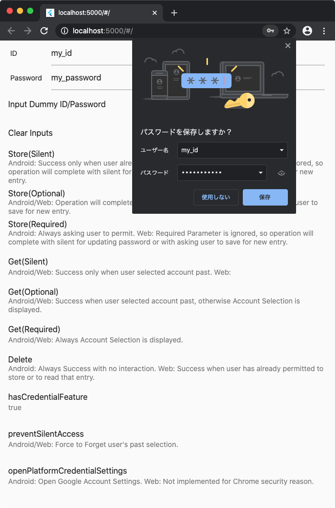
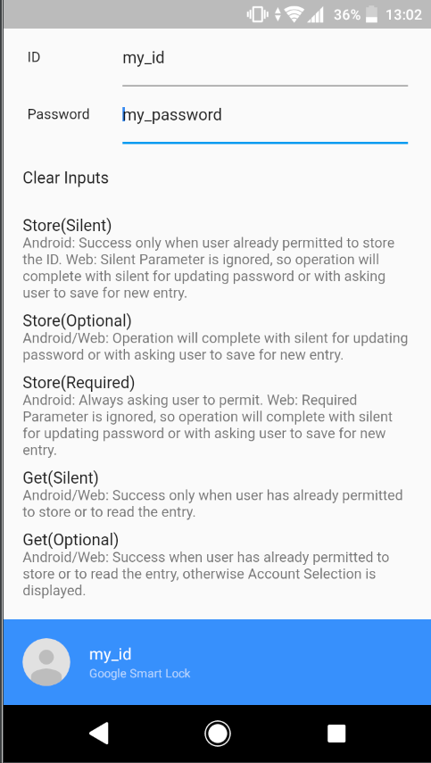

# password_credential

Flutter Plugin for Password Credentials Access.

* Web (Chrome): Credentials Management API
    * [Chrome Credentials Management Document](https://developers.google.com/web/fundamentals/security/credential-management/retrieve-credentials?hl=en)
* Android: Smartlock for Password
    * [Android Smartlock for Password Document](https://developer.android.com/distribute/best-practices/develop/smart-lock-for-passwords)

ID and Passwords stored in Credential Management API or Smartlock are synced when user logged in Chrome or Android with same Google Account.

## example

Web Example Project.

Android Example Project.

